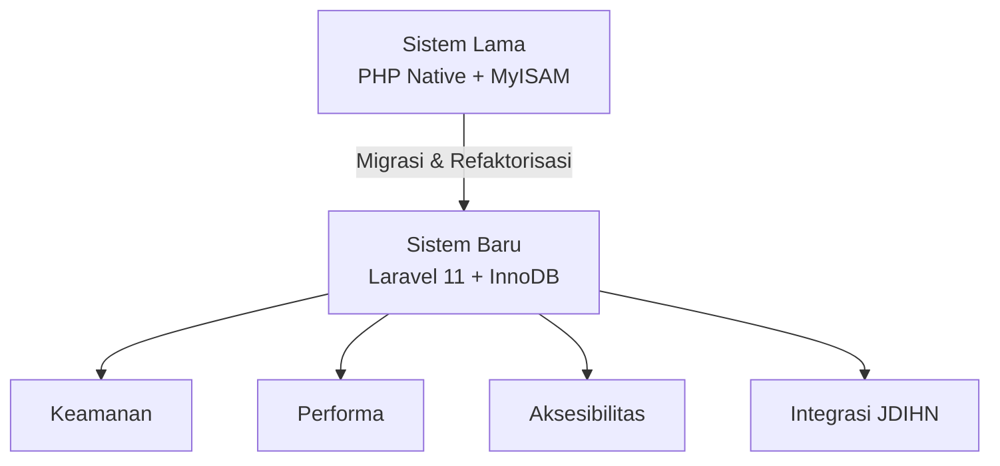
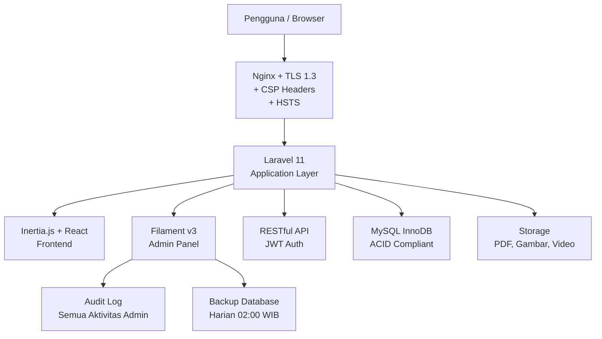
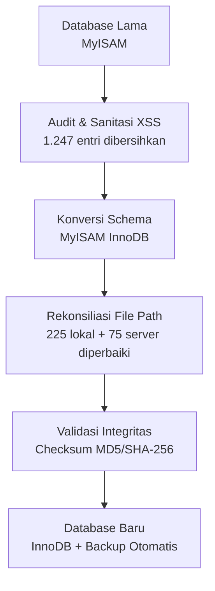
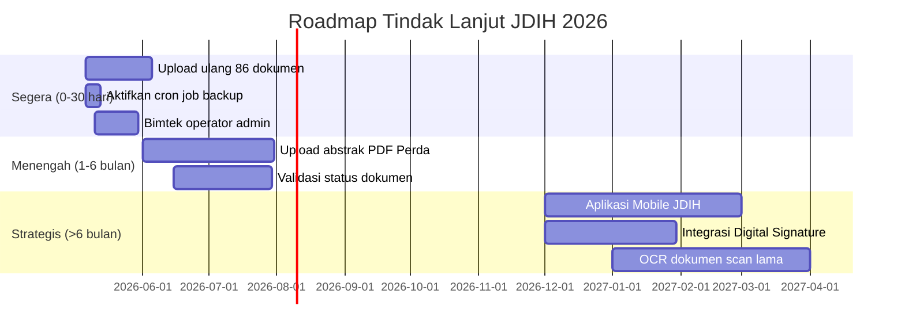

# LAPORAN RESMI MIGRASI SISTEM
## Portal Jaringan Dokumentasi dan Informasi Hukum (JDIH)
### Kabupaten Banjarnegara Tahun Anggaran 2026

---

> **Kepada Yth.:** Kepala Bagian Hukum Sekretariat Daerah Kabupaten Banjarnegara
> **Dari:** Tim Exadata Divisi App, Clasnet Group
> **Tanggal:** 5 Mei 2026 | **No. Dok:** EXD/JDIH/MIG/2026/001
> **Sifat:** Resmi Internal Pemerintah

---

## I. PENDAHULUAN

Portal JDIH Kabupaten Banjarnegara telah berhasil dimigrasikan dari sistem lama (*legacy*) berbasis PHP Native ke platform modern berbasis **Laravel 11, React (Inertia.js), dan Filament v3**. Proses migrasi bertujuan:

- Meningkatkan keamanan sesuai standar **BSSN** dan Permenkominfo No. 20/2022
- Menjamin integritas data produk hukum secara berkelanjutan
- Menghadirkan layanan publik digital yang responsif dan inklusif

---

## II. ARSITEKTUR SISTEM

### 2.1 Alur Transformasi

### 2.2 Arsitektur Teknis Sistem Baru

---

## III. PERBANDINGAN SISTEM

| Aspek | Sistem Lama | Sistem Baru | Status |
|-------|-------------|-------------|--------|
| **Framework** | PHP Native + Metronic 8 | Laravel 11 + React + Filament v3 | |
| **Database Engine** | MySQL MyISAM | MySQL InnoDB (ACID) | |
| **Keamanan XSS** | Terdeteksi payload aktif | CSP + ORM + Sanitasi | |
| **Captcha Login** | Statis (selalu 5+5=10) | Acak, kadaluarsa 5 menit | |
| **Header Server** | X-Powered-By terekspos | Disembunyikan (2 layer) | |
| **Tampilan** | Statis, berat | Responsif, mobile-first | |
| **Manajemen File** | Path manual absolut | Storage terstruktur | |
| **API Integrasi** | Tidak ada | RESTful API + JWT | |
| **Audit Log** | Tidak ada | Log semua aktivitas admin | |
| **Backup Database** | Manual/tidak terjadwal | Otomatis harian + UI admin | |
| **Ukuran Logo** | 226 KB PNG | 29 KB WebP (hemat 87%) | |

---

## IV. HASIL MIGRASI DATA

### 4.1 Statistik (Per 5 Mei 2026)

| Kategori | Jumlah |
|----------|--------|
| Total Produk Hukum | **1.515 dokumen** |
| File PDF tersedia | **1.429 (94,3%)** |
| Dalam proses digitalisasi | 86 dokumen |
| Kategori/Jenis | 30 kategori |
| Rentang Tahun | 1913 2026 |
| Putusan Hukum | 5 putusan |
| Berita & Artikel | 48 berita |

### 4.2 Alur Proses Migrasi Data

---

## V. FITUR BARU

| No | Fitur | Status |
|----|-------|--------|
| 1 | **Asisten AI 24/7** (Groq API) | Aktif |
| 2 | **Dialog Publik** (aspirasi warga) | Aktif |
| 3 | **Konsultasi Hukum Online** | Aktif |
| 4 | **Integrasi API Desa** (real-time) | Aktif |
| 5 | **Pencarian Universal** | Aktif |
| 6 | **Dashboard Statistik** | Aktif |
| 7 | **Print Laporan Admin** | Aktif |
| 8 | **Audit Log Aktivitas Admin** | Baru |
| 9 | **Backup Database + UI Admin** | Baru |

---

## VI. REKOMENDASI TINDAK LANJUT

---

## VII. PENUTUP

Proses migrasi Portal JDIH Kabupaten Banjarnegara Tahun Anggaran 2026 telah dilaksanakan dengan hasil signifikan pada aspek keamanan, performa, dan layanan publik.

**Banjarnegara, 5 Mei 2026**

| Disusun Oleh | Diverifikasi Oleh |
|:---:|:---:|
| **Tim Exadata** | **Kepala Bagian Hukum** |
| Divisi App Clasnet Group | Setda Kab. Banjarnegara |
| *(Tanda Tangan)* | *(Tanda Tangan & Cap Dinas)* |

---
* 2026 Clasnet Group / Exadata Divisi App Dokumen Resmi*
