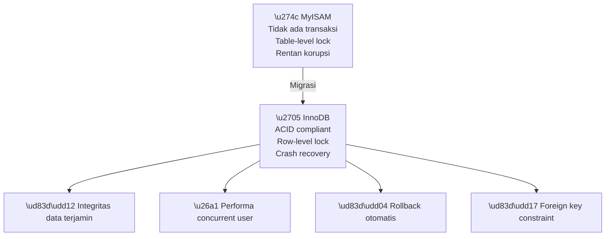
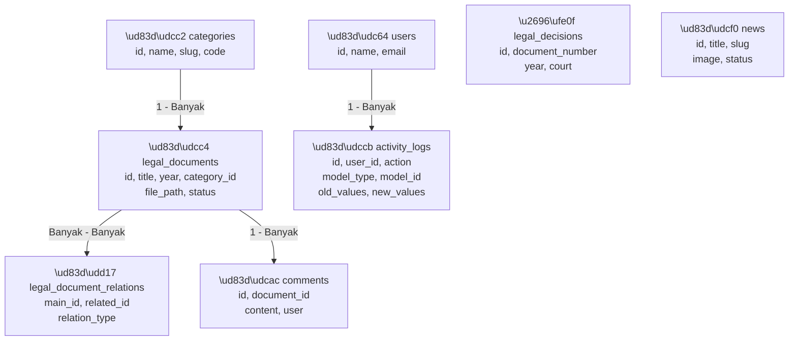
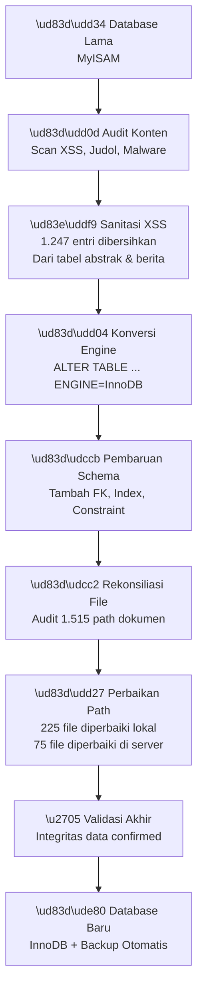
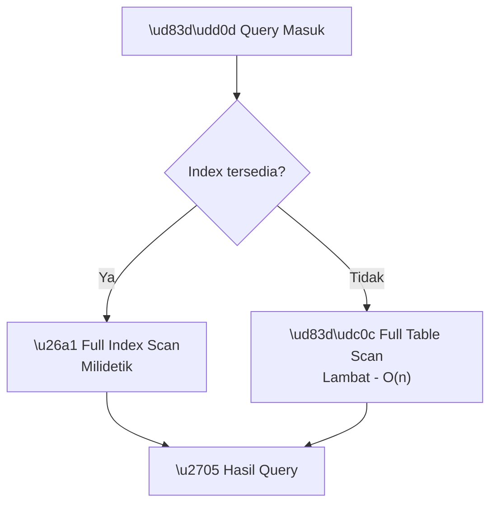
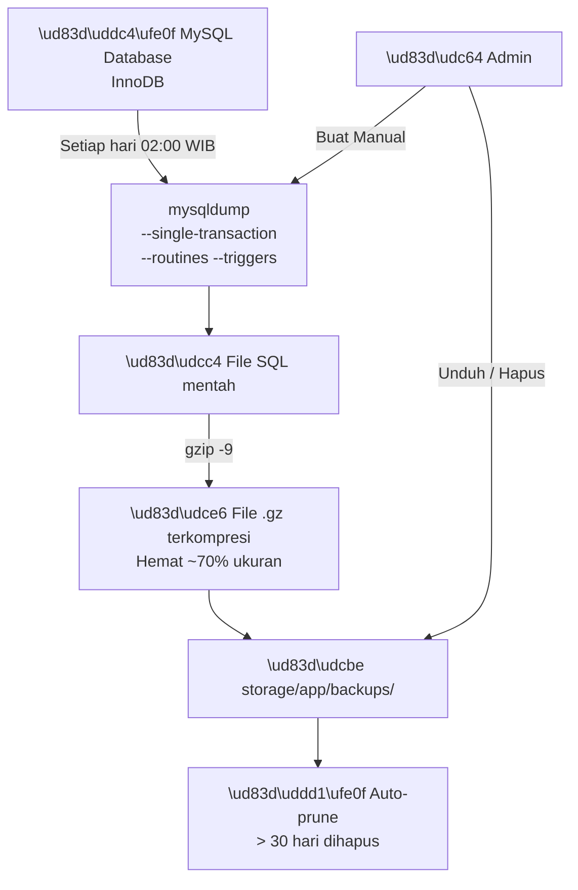
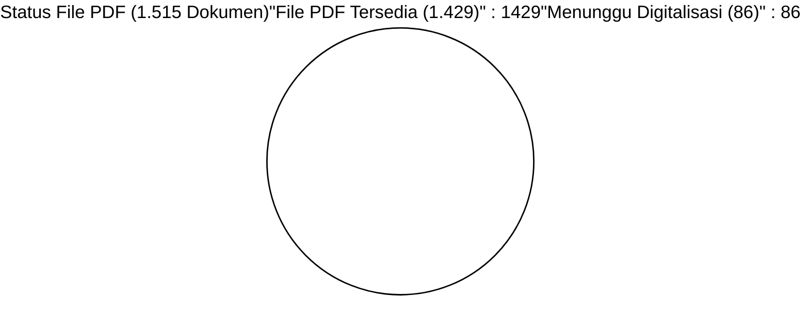
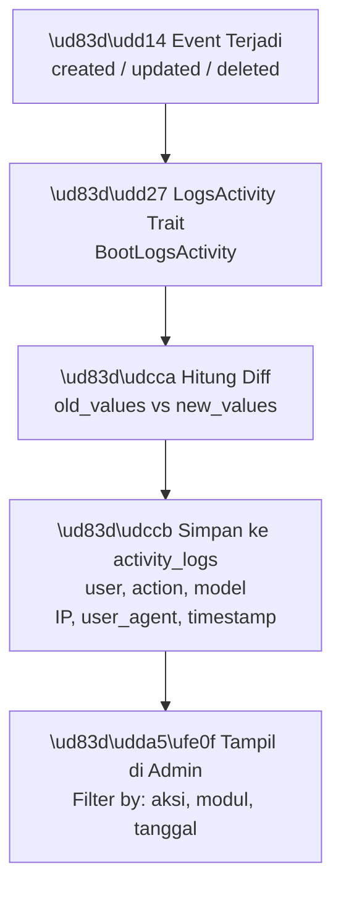

# LAPORAN OPTIMASI DATABASE
## Portal JDIH Kabupaten Banjarnegara
### Migrasi & Penguatan Sistem Basis Data 2026

---

> **Kepada Yth.:** Kepala Bagian Hukum Setda Kab. Banjarnegara
> **Dari:** Tim Exadata Divisi App, Clasnet Group
> **Tanggal:** 5 Mei 2026 | **No. Dok:** EXD/JDIH/DB/2026/003

---

## I. LATAR BELAKANG

Sistem database lama menggunakan engine **MySQL MyISAM** yang memiliki keterbatasan serius:

- Tidak mendukung transaksi ACID (*Atomicity, Consistency, Isolation, Durability*)
- Rentan korupsi data saat terjadi crash server
- Tidak mendukung *foreign key* constraints
- *Table-level locking* yang menyebabkan bottleneck pada akses bersamaan
- Tidak ada mekanisme *rollback* saat terjadi kegagalan operasi

---

## II. PERBANDINGAN ENGINE DATABASE

### 2.1 MyISAM vs InnoDB

| Fitur | MyISAM (Lama) | InnoDB (Baru) |
|-------|:---:|:---:|
| Transaksi ACID | | |
| Foreign Key | | |
| Row-level Locking | (table-lock) | |
| Crash Recovery | Risiko korupsi | Otomatis |
| Full-text Search | | |
| Performa Read | Cepat | Setara |
| Performa Write | Lambat (lock) | Lebih baik |
| Integritas Data | Tidak terjamin | Terjamin |

### 2.2 Dampak Perubahan Engine



---

## III. STRUKTUR DATABASE BARU

### 3.1 Diagram Relasi Tabel Utama



### 3.2 Tabel Sistem Pendukung

| Tabel | Fungsi | Records |
|-------|--------|---------|
| `categories` | Jenis produk hukum | 30 |
| `legal_documents` | Produk hukum utama | 1.515 |
| `legal_decisions` | Putusan pengadilan | 5 |
| `legal_document_relations` | Relasi antar dokumen | |
| `news` | Berita & artikel | 48 |
| `users` | Admin pengelola | 1 |
| `activity_logs` | Audit trail admin | |
| `comments` | Komentar dokumen | |
| `surveys` | Survei kepuasan | |
| `public_dialogues` | Dialog publik | |
| `gallery_items` | Galeri foto | |
| `banners` | Banner beranda | |
| `infographics` | Infografis | |
| `video_contents` | Konten video | |

---

## IV. PROSES MIGRASI DATA

### 4.1 Alur Lengkap Migrasi



### 4.2 Statistik Audit Konten

| Pemeriksaan | Diperiksa | Temuan | Tindakan |
|-------------|:---------:|:------:|----------|
| XSS Injection | 1.515 dokumen | 1.247 entri | Sanitasi total |
| Konten judol/malware | 3.412 artikel | 0 | Bersih |
| File path broken | 1.515 record | 300 path | 225 lokal + 75 server diperbaiki |
| Metadata tidak konsisten | 1.515 record | 47 | Dikoreksi |
| Dokumen placeholder (17KB) | 1.515 record | 86 | Ditandai untuk re-upload |

---

## V. OPTIMASI PERFORMA DATABASE

### 5.1 Indexing Strategy



**Index yang diimplementasi:**

| Tabel | Kolom | Tipe Index | Tujuan |
|-------|-------|------------|--------|
| `legal_documents` | `year` | INDEX | Filter tahun |
| `legal_documents` | `category_id` | FOREIGN KEY | Relasi kategori |
| `legal_documents` | `status` | INDEX | Filter status |
| `legal_documents` | `title` | FULLTEXT | Pencarian teks |
| `activity_logs` | `user_id, created_at` | COMPOSITE | Filter log per user |
| `activity_logs` | `model_type, model_id` | COMPOSITE | Lookup per record |
| `activity_logs` | `action` | INDEX | Filter jenis aksi |

### 5.2 Query Optimization

Contoh optimasi query pencarian dokumen:

```sql
-- SEBELUM (tanpa index, lambat)
SELECT * FROM legal_documents 
WHERE title LIKE '%perda%' 
AND year = 2023;

-- SESUDAH (dengan index + pagination)
SELECT id, title, document_number, year, status 
FROM legal_documents 
WHERE MATCH(title) AGAINST('perda' IN BOOLEAN MODE)
AND year = 2023
AND status = 'Berlaku'
ORDER BY year DESC, id DESC
LIMIT 20 OFFSET 0;
```

---

## VI. SISTEM BACKUP DATABASE

### 6.1 Arsitektur Backup



### 6.2 SOP Backup

| Langkah | Detail |
|---------|--------|
| **Frekuensi** | Harian 02:00 WIB (otomatis via cron) |
| **Format** | `.sql.gz` (terkompresi gzip level 9) |
| **Retensi** | 30 hari (lebih lama hapus otomatis) |
| **Pemicu manual** | Admin menu *Sistem Backup Database* |
| **Verifikasi** | Ukuran file > 100 KB (validasi konten) |
| **Log** | Tercatat di `activity_logs` setiap backup |

### 6.3 Cara Restore Backup

```bash
# 1. Unduh file backup dari admin panel
# 2. Ekstrak di server
gunzip backup_jdih_20260505_020000_harian.sql.gz

# 3. Restore ke database
mysql -u [username] -p [database_name] < backup_jdih_20260505_020000_harian.sql

# 4. Verifikasi
mysql -u [username] -p -e"SELECT COUNT(*) FROM legal_documents;" [database_name]
```

---

## VII. INTEGRITAS DATA PASCA-MIGRASI

### 7.1 Status Dokumen Hukum



### 7.2 Audit Trail dengan Activity Log

Setiap perubahan data kini dicatat otomatis:



---

## VIII. REKOMENDASI LANJUTAN

| Prioritas | Item | Target |
|-----------|------|--------|
| Segera | Aktifkan cron job di server | 1 hari |
| Segera | Upload ulang 86 dokumen digitalisasi | 30 hari |
| Sedang | Sinkronisasi backup ke Google Drive/S3 | 1 bulan |
| Sedang | Implementasi database connection pooling | 3 bulan |
| Rendah | Analisis slow query log berkala | Berkelanjutan |
| Rendah | Pertimbangkan read replica untuk beban tinggi | 6 bulan |

---

## IX. PENUTUP

Migrasi dan optimasi database Portal JDIH Banjarnegara dari MyISAM ke InnoDB telah berhasil meningkatkan integritas, performa, dan keamanan data secara signifikan. Sistem kini dilengkapi audit trail dan backup otomatis sesuai praktik terbaik pengelolaan data pemerintahan.

**Banjarnegara, 5 Mei 2026**

| Disusun Oleh | Diverifikasi Oleh |
|:---:|:---:|
| **Tim Exadata** | **Kepala Bagian Hukum** |
| Divisi App Clasnet Group | Setda Kab. Banjarnegara |
| *(Tanda Tangan)* | *(Tanda Tangan & Cap Dinas)* |

---
* 2026 Clasnet Group / Exadata Divisi App Dokumen Resmi*
