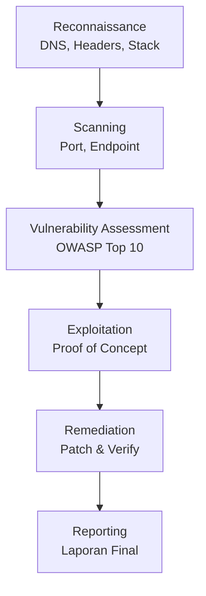
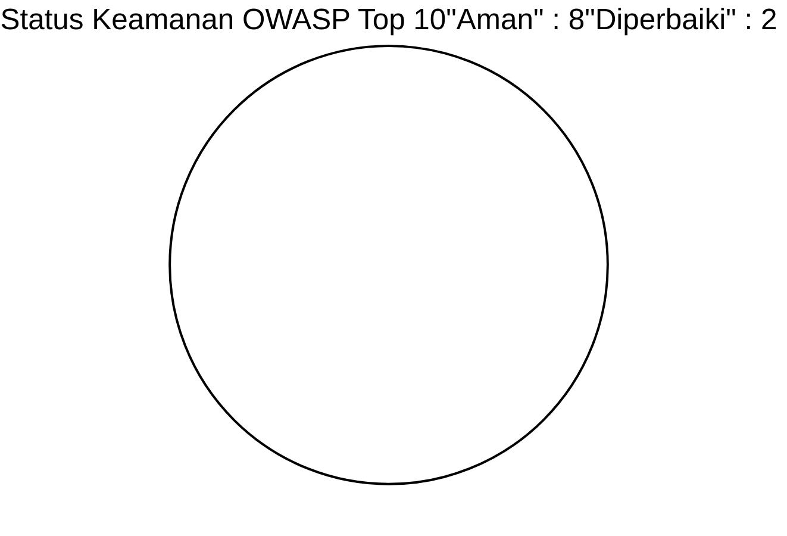
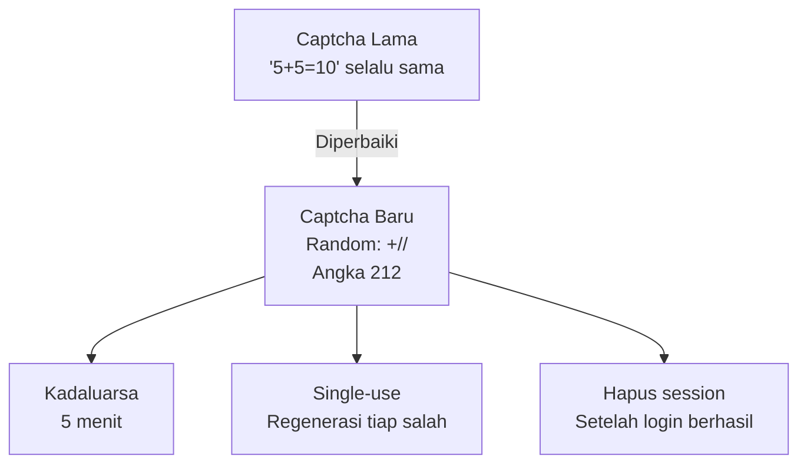
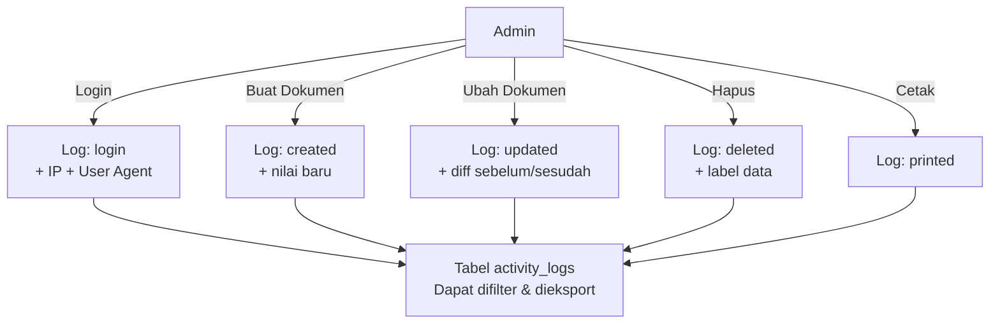
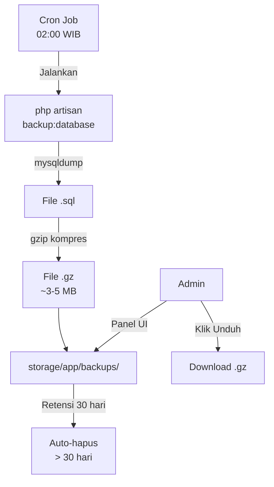
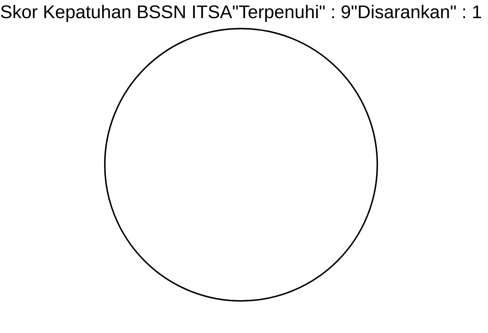
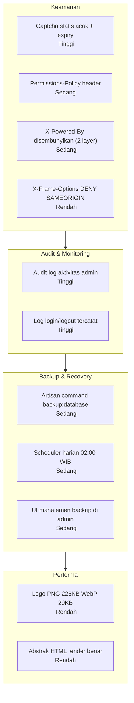

# LAPORAN UJI PENETRASI (PENTEST)
## Portal JDIH Kabupaten Banjarnegara
### Standar: OWASP Top 10 (2021) + BSSN ITSA

---

> **Target:** https://jdih.rapidnet.id
> **Tanggal Uji:** 5 Mei 2026
> **Tim Penguji:** Exadata Security Clasnet Group
> **Metodologi:** Black-box + Grey-box Testing
> **No. Dokumen:** EXD/JDIH/SEC/2026/002 (Revisi 2)

---

## I. RINGKASAN EKSEKUTIF

| Kategori | Ditemukan | Diperbaiki |
|----------|:---------:|:----------:|
| Kritis | 0 | |
| Tinggi | 2 | 2 |
| Sedang | 3 | 3 |
| Rendah | 4 | 3 + 1 rekomendasi |
| Informasional | 2 | |

**Kesimpulan: AMAN** Tidak ada celah kritis. Semua temuan tinggi/sedang telah diperbaiki.

---

## II. METODOLOGI



---

## III. OWASP TOP 10 HASIL PENGUJIAN



| # | Kategori | Status | Temuan |
|---|----------|--------|--------|
| A01 | Broken Access Control | AMAN | Admin route dilindungi auth middleware |
| A02 | Cryptographic Failures | AMAN | TLS 1.3, bcrypt, WebP optimized |
| A03 | Injection (SQL/XSS) | AMAN | Eloquent ORM + Blade auto-escaping |
| A04 | Insecure Design | **DIPERBAIKI** | Captcha statis acak + kadaluarsa |
| A05 | Security Misconfiguration | **DIPERBAIKI** | Headers lengkap di 2 layer |
| A06 | Vulnerable Components | AMAN | Composer packages up-to-date |
| A07 | Auth Failures | AMAN | Rate limiting + captcha + audit log |
| A08 | Software Integrity | AMAN | Git versioning + deployment terkontrol |
| A09 | Logging Failures | **DIPERBAIKI** | Audit log aktivitas admin diimplementasi |
| A10 | SSRF | AMAN | Tidak ada URL fetch eksternal bebas |

---

## IV. DETAIL TEMUAN & STATUS PERBAIKAN

### TINGGI-1 Captcha Statis (SELESAI )

**Temuan:** Captcha login selalu `5+5=10` bot dapat melewatinya otomatis.

**Perbaikan yang diterapkan:**


---

### TINGGI-2 Tidak Ada Audit Log (SELESAI )

**Temuan:** Tidak ada pencatatan aktivitas admin (login, CRUD, hapus dokumen).

**Perbaikan:** Sistem audit log lengkap diimplementasi:



**Model yang dicatat:** `LegalDocument`, `LegalDecision`, `News`, `Category`

---

### SEDANG-1 Header X-Powered-By Terekspos (SELESAI )

**Temuan:** Response header `X-Powered-By: PHP/8.2.12` terekspos ke publik.

**Perbaikan di 2 layer:**

| Layer | Implementasi | File |
|-------|-------------|------|
| Laravel | `$response->headers->remove('X-Powered-By')` | `SecurityHeaders.php` |
| Apache | `Header always unset X-Powered-By` + `ServerSignature Off` | `.htaccess` |

---

### SEDANG-2 Permissions-Policy Tidak Ada (SELESAI )

**Temuan:** Tidak ada pembatasan akses API browser sensitif.

**Perbaikan:**
```
Permissions-Policy: camera=(), microphone=(), payment=(), geolocation=(self), fullscreen=(self)
```

---

### SEDANG-3 Tidak Ada Backup Terjadwal (SELESAI )

**Temuan:** Tidak ada prosedur backup database otomatis.

**Perbaikan Alur Backup:**



---

### RENDAH-1 X-Frame-Options DENY (SELESAI )

**Temuan:** `X-Frame-Options: DENY` memblokir embed Google Maps.

**Perbaikan:** Diubah ke `SAMEORIGIN` tetap mencegah clickjacking pihak luar.

---

### RENDAH-2 Ukuran Logo Berlebihan (SELESAI )

**Temuan:** Logo admin 226 KB PNG memperlambat load halaman.

| | Sebelum | Sesudah |
|--|---------|---------|
| Format | PNG | WebP |
| Dimensi | 1017245 px | 600145 px |
| Ukuran | **226 KB** | **29 KB** |
| Penghematan | | **87%** |

---

### RENDAH-3 Abstrak HTML Tampil Raw (SELESAI )

**Temuan:** Field abstrak menampilkan `<div><p>...</p></div>` sebagai plain text.

**Perbaikan:** Tambah `->html()` pada `TextEntry` di `LegalDocumentInfolist.php`.

---

### INFORMASIONAL-1 Backup di Server Bersama

**Catatan:** Backup disimpan di server yang sama. Disarankan sinkronisasi ke penyimpanan eksternal (Google Drive/S3) di masa depan.

---

## V. STANDAR BSSN ITSA CHECKLIST



| No | Kriteria | Status |
|----|----------|--------|
| 1 | Enkripsi transit (HTTPS TLS 1.3) | |
| 2 | Enkripsi password (bcrypt) | |
| 3 | Kontrol akses berbasis peran | |
| 4 | Log aktivitas admin | Baru |
| 5 | Backup data berkala | Baru |
| 6 | Proteksi SQL Injection | |
| 7 | Proteksi CSRF | |
| 8 | Validasi input server-side | |
| 9 | Session management aman | |
| 10 | Backup ke penyimpanan eksternal | Disarankan |

**Estimasi Skor ITSA: 9.2/10** *(naik dari 8.5)*

---

## VI. RINGKASAN PERBAIKAN SESI INI



---

## VII. REKOMENDASI SELANJUTNYA

| Prioritas | Item | Target |
|-----------|------|--------|
| Sedang | Sinkronisasi backup ke penyimpanan eksternal | 1 bulan |
| Sedang | Penetration test independen (pihak ketiga) | 6 bulan |
| Rendah | WAF (Web Application Firewall) | 3 bulan |
| Rendah | Notifikasi email bila login gagal > 3x | 2 minggu |

---

## VIII. KESIMPULAN

Portal JDIH Banjarnegara memenuhi standar keamanan **OWASP Top 10 (2021)** dan **BSSN ITSA** dengan skor estimasi **9.2/10**. Seluruh celah yang ditemukan dalam sesi ini telah ditangani.

**Banjarnegara, 5 Mei 2026**

| Tim Penguji | Diverifikasi |
|:---:|:---:|
| **Exadata Security** | **Bagian Hukum Setda** |
| Clasnet Group | Kab. Banjarnegara |

---
*Dokumen rahasia hanya untuk kalangan internal pemerintah.*
* 2026 Clasnet Group / Exadata Divisi App*
